# Concurrency in go 
### Concurrency is about multiple things happening at same time in random order
go have build in support

cc is composition of independent execution computations, which may or may not run in parallel.


## Process and Thread

#### What is a Process ?
A process is a instance of a running program called a process.
A process provides evn for program to execute.
- OS : allocates memory 
- Code:machine code 
- Data- global data
- Heap- Dynamic memory  allocation 
- Stack- Location variable function

### Thread 
- thread are Smallest unit of execution that CPU accepts.
- Process has aleast on thread - main thread 
- Process can have multiple thread 
- Thread share same address spaces ? each tread have its own stack.
- Thread runs independently of each other
- Os Schedular makes scheduling decision at thread leval not 


### Context Switch 


Process Context
- Process state
- CPU scheduling Information
- Memory management information
- Accounting information
- 1/0 Status information

Thread Context
 - Program counter
 - CPU registers
 - Stack

##### context switch between thread is cheap as compare to process context switching 
 
#  Go routines 


- We can think Goroutines as user space threads
managed by go runtime.

- Goroutines extremely lightweight. Goroutines starts with
2KB of stack, which grows and shrinks as required.

- Low CPU overhead - three instructions per function call.

- Can create hundreds of thousands of goroutines in the
same address space.

- Channels are used for communication of data between
goroutines. Sharing of memory can be avoided.

- context switch between goroutines are cheap


based on  Communicating Sequential Processes (CSP) |  three core ideas.

## Each process is built for sequential execution.
- Every process has a local state and the process operates on that local state.

## Data is communicated between processes. No shared memory.
- If we have to transfer data from one process to another process, we do not share memory, but we communicate the data, we send a copy of the data over to other process. Since there is no sharing of memory, there would be no race, condition or deadlocks,

## Scale by adding more of the same.


# So what tools Go provides for concurrency?

## goroutines
- goroutines are concurrently executing functions,


## channels
- channels are used to communicate data between the goroutines.

## Select 
- Select is used to multiplex the channels, sync package.

## Sync package
- provides classical synchronization tools like the mutex, conditional variables and others.

## Go Runtime
- Go runtime creates worker OS threads 
- Goroutines runs in the context of
OS thread.

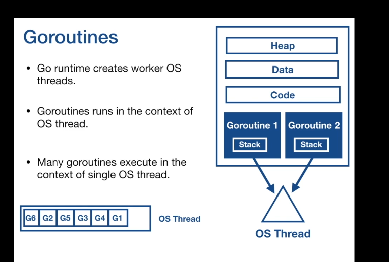

the OS threads and the Go runtime schedules, multiple goroutines on the OS thread.

Many goroutines can execute in the context of the single OS thread. The operating system schedules,

the OS threads and the Go runtime schedules, multiple goroutines on the OS thread.

For the operating system, nothing has changed, it is still scheduling the threads, as it was.

Go runtime manages the scheduling of the goroutines on the OS threads.


 

### What are advantages of goroutines over OS threads?

* Goroutine are extremely lightweight compared to OS
threads.

* Stack size is very small of 2kb as opposed to 8MB of stack
of OS threads.

* Context switching is very cheap as it happens in user
space, goroutines have very less state to be stored.

* Houndreds of thousands of goroutines can be created on
single machine.


go rutine execute async from main routine 

## Race Condition

## async wait group 
Go follows logical concurrency model called fork and join.
go statement forks a goroutine, when a goroutine is done with its job, it joins back to the main

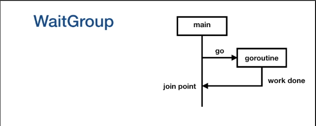

it is possible that main execution will finish before the fork process get change to join, 

-  In order to create a join point, we use sync wait group, to deterministically block the main routine.

```


var wg sync.WaitGroup
wg.Add(1)  // number of go routine  we are creating 


go function(){
    defer wg.Done(); //  go routine is exiting 
}

wg.Wait() // block go routine un till all go routine are exited 

```

wait group is like a concurrent counter


call to add increases the counter by the integer that is passed in, call to done will decrement the counter by one,  call to wait, will block until the counter becomes zero.


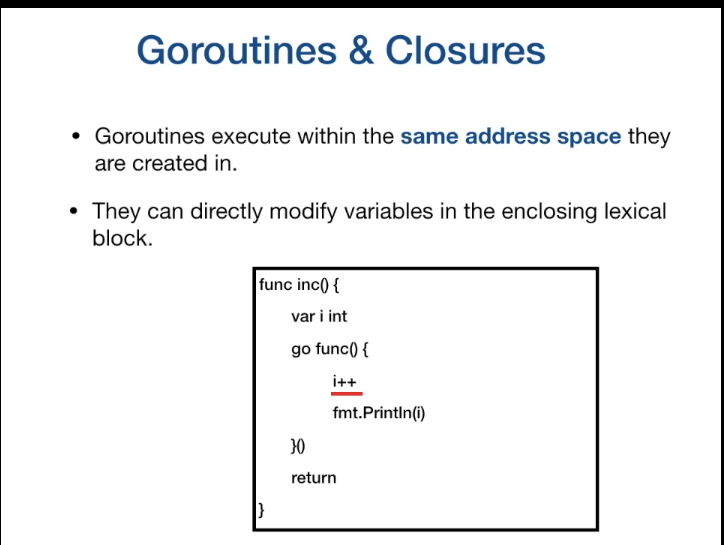


## Go Schedular

is part of go runtime . M:N schedular Go schedular runs in user space.

Go Schedular runs in user space. Go schedular uses OS thread to schedule goroutines for excitation.

Go runtime creates a number of worker OS threads, equal to GOMAXPROCS environment variable value, the default

It is the responsibility of the Go scheduler to distribute runnable goroutines over multiple threads that


> For a CPU core, Go runtime creates a OS thread, which is represented by the letter M. OS thread works pretty much like POSIX thread. 

> Go runtime also creates a logical processor P and associate that with the OS thread M. The logical processor holds the context for scheduling, which can be seen as a local scheduler running on a thread.

> G represents a goroutine running on the OS thread.  Each logical processor P has a local run queue where runnable goroutines are queued.


>There is a global run queue, once the local queue is exhausted, the logical processor will pull goroutines from global run queue. When new goroutines are created, they're added to the end of the global run queue.

 Let's  see a context switch.

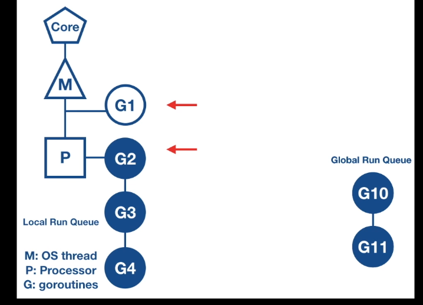

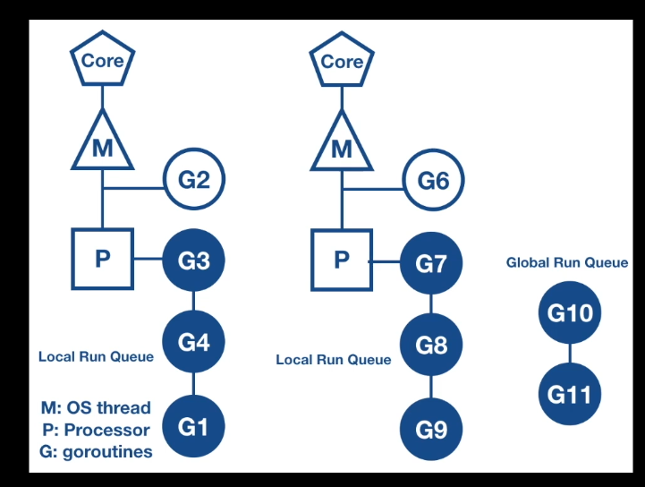

> Goroutine G1 has reached a scheduling point,then the logical processor will pop a goroutine from its local run queue in this case G2 and sets the stack and  the instruction pointer for the goroutine G2 and begins running that goroutine, the previously running goroutine G1, is placed back into the local run queue.

There is no change as far as the OS is concerned. It is still scheduling the same OS thread.
each go routine have 10ms fot run 

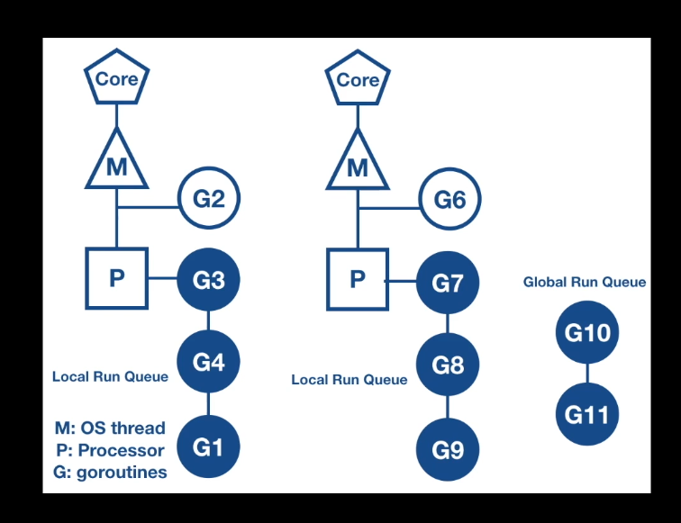


# Context Switching  due to async system call 


What happens in general when a goroutine makes a synchronous system call, like reading or writing to a file with sync flag set.
There will be a disc I/O to be performed, so synchronous system call will block for I/O operation to complete.
Due to which the OS thread can be moved out of the CPU and placed in the waiting queue for the disc I/O to complete.

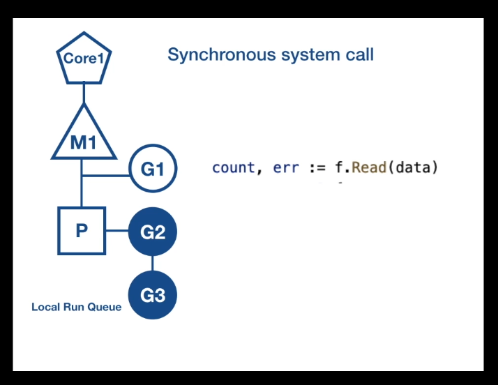


G1 is going to make synchronous system call, like reading on a file, that will make the OS thread M1 to block.

Go scheduler identifies that G1 has caused OS thread M1 to block, so it brings in a new OS thread, either Go scheduler identifies that G1 has caused OS thread M1 to block, so it brings in a new OS thread, either

Then Go scheduler will detach the logical processor P from the OS thread M1, and moves it to the new OS thread M2. G1 is still attached to the old OS thread M1.

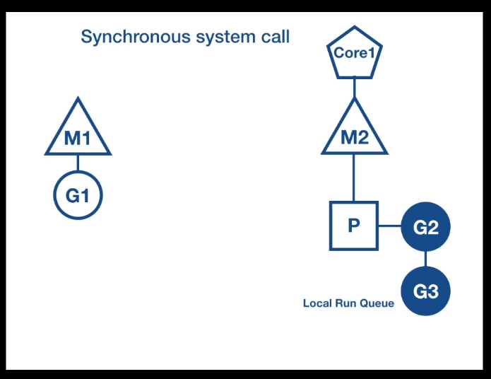

The logical processor P can now schedule other goroutines in its local run queue for execution on the OS thread M2.


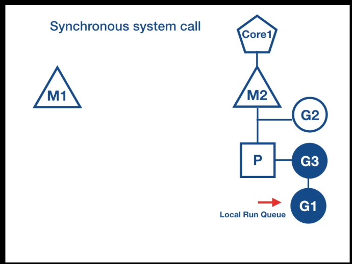

Once the synchronous system call that was made by G1 is complete, then it is moved back to the end of the local run queue on the logical processor P.
And M1 is put to sleep and placed in the thread pool cache. So that it can be utilized in the future when the same scenario needs to happen again.


## Context switch due to synchronization system call

G1 is going to make synchronous system call, like reading on a file, that will make the OS thread M1 to block.

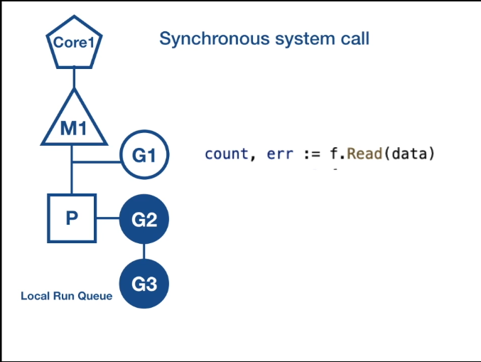

Go scheduler identifies that G1 has caused OS thread M1 to block, so it brings in a new OS thread, either from the thread pool cache or it creates a new OS thread if a thread is not available in the thread pool.


Then Go scheduler will detach the logical processor P from the OS thread M1, and moves it to the new OS thread M2. Then

G1 is still attached to the old OS thread M1.

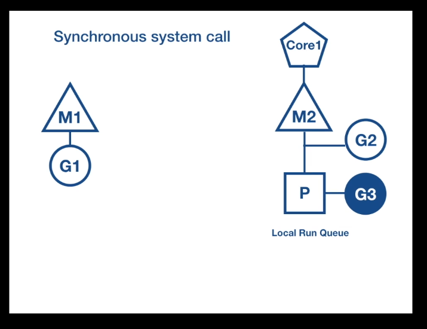

G1 is still attached to the old OS thread M1. The logical processor P can now schedule other goroutines in its local run queue for execution on the OS thread M2.

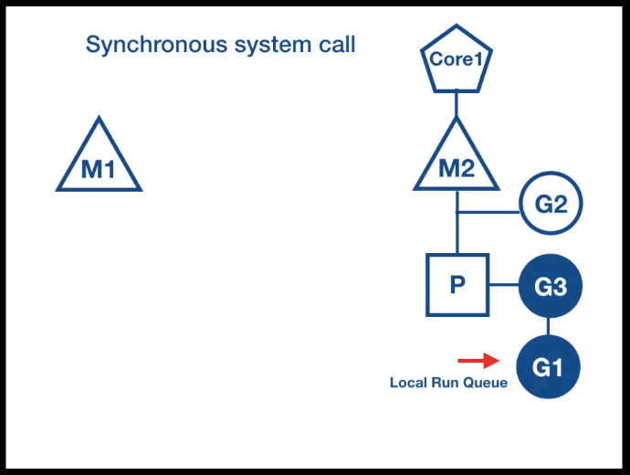

Once the synchronous system call that was made by G1 is complete, then it is moved back to the end of the local run queue on the logical processor P.

And M1 is put to sleep and placed in the thread pool cache.

> When a goroutine makes a synchronous system call,  Go scheduler brings new OS thread from thread pool cache. And it moves the logical processor to the new thread.

> Goroutine that made the system call, will still be attached to the old thread.

> other goroutines in the local run queue are scheduled for execution on the new thread.

> Once the system call returns, the goroutine which made the system call, is moved back to the local run queue of the logical processor and old thread is put to sleep.


##  Context switching due to Asynchronous system call 

> File descriptor is set to non-blocking mode . if file descriptor is not ready, I/O operation , system call does not block , but returns an error.

> Asynchronous Io increases the application complexity.
> Setup event loops using callbacks functions.


# Channels
> communicate between go routines . Synchronously goroutines.
> Channels are typed 
> thread -safe 

```
var ch chan T
```
default value in nil 

```
ch=make(chan T)
// <- operator to send or receive the value from channel.
// "arrow" that the direction of data flow 

```

Go routines wait for a receiver ti be ready. Go routine 

` close(ch) `

```
value,ok=<-ch
```

## Channel Deep drive 

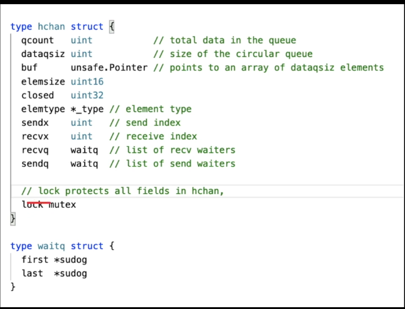


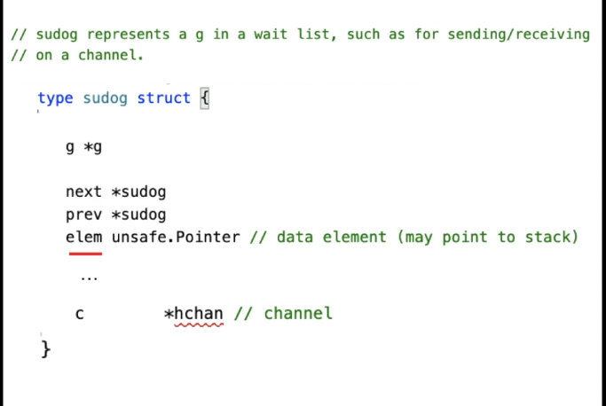

G is pointer to go routines. 

`elem` field is pointer to memory, which contains value to be sent, or the value will be received.

### Any go routine doing any channel operation must acquire  the lock on channel.


```
ch:=make(chan int,3)
```
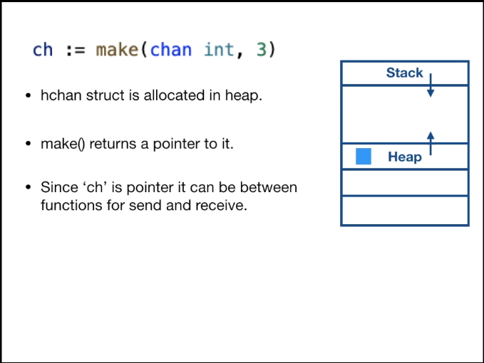

1. `hchan` struct is allocated in heap space.
2. `make()` returns a pointer
3. since `ch` is pointer it can be between functions for send and receive

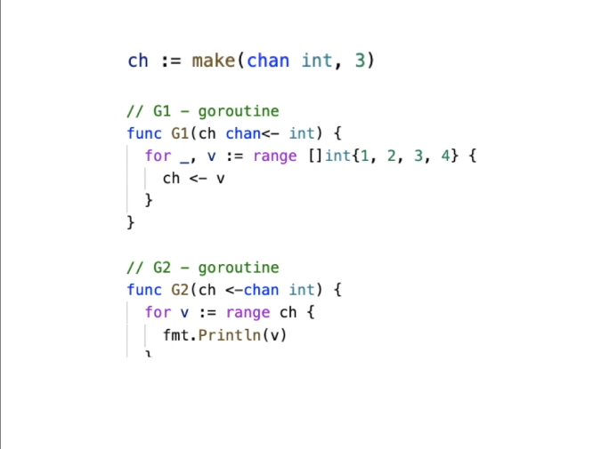


### Channel Representation

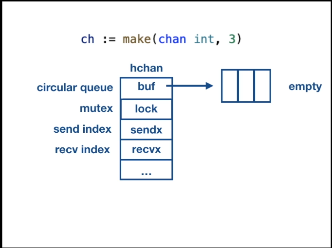

#### Scenario-1

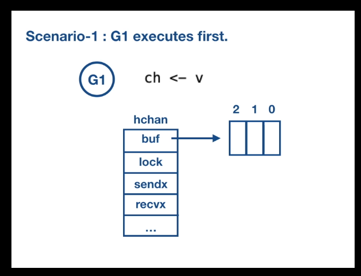


Let us now consider the scenario when the G1 executes first, G1 is trying to send a value on the channel, which has empty buffer.

1. go routine have to acquire the local on head chan struct.

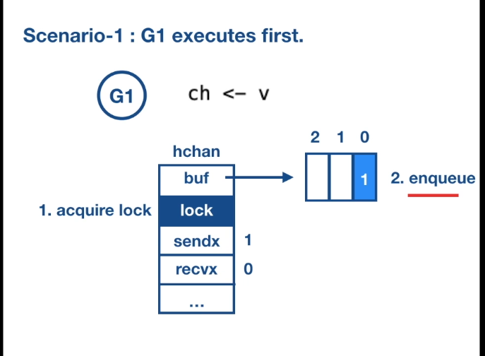

1. First, the goroutine has to acquire the lock on the hchan struct.
2. Then it enqueues the element into the circular ring buffer. 
3. The element is copied into the buffer.
4. Then it increments the value of the sendx to 1.
5. Then local is released

G2- tries to receive the chanel 

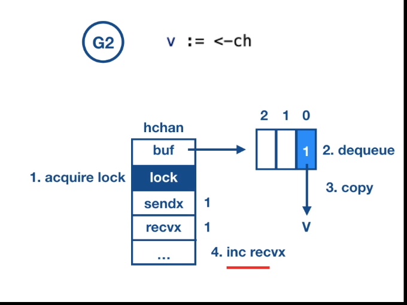

1. Now G2 comes along and tries to receive the value from the channel.
2. First, it has to acquire the lock on the hchan strut, then it dequeues the element from the buffer queue and copies the value to its variable, v.
3. And it increments the receive index by one and releases the lock on the channel struct and proceeds with its other computation.


> Their is no memory sharing between goroutins 

> gorutins copy elements into and from hchan 

> hchan is protected by mutex 


## What happen when buffer is full?


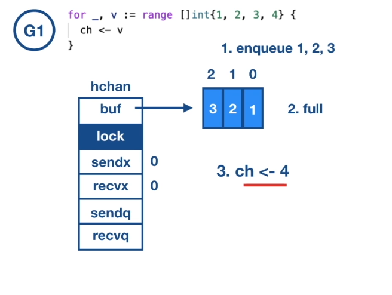


# Select 
Scenario

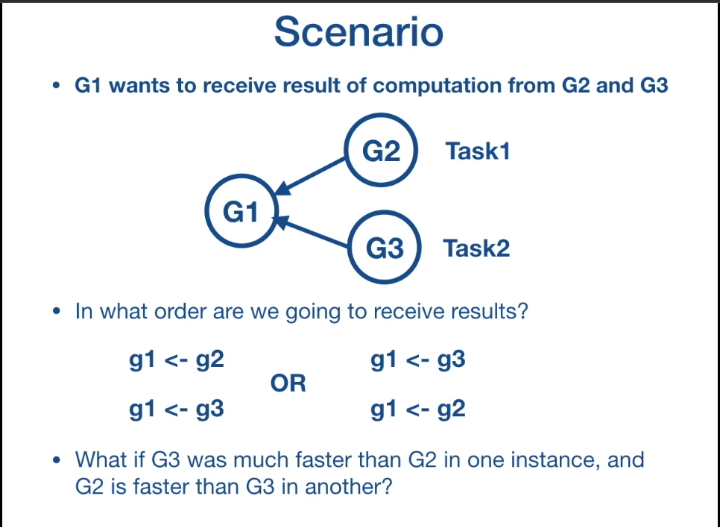

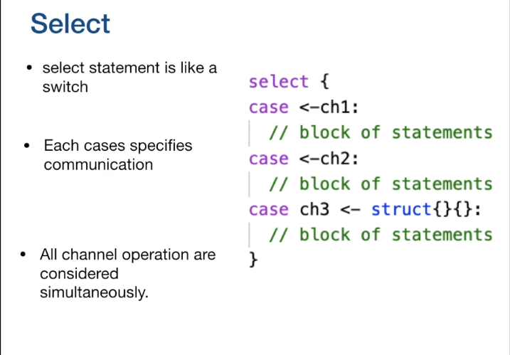

When one channel is ready it runs the following code.


# Sync Package 


## When to use mutex and when to use channel ? 

<table>

<tr>
<th>Channel </th>
<th>Mutex</th>
</tr>

<tr>
<td>
Channel passes copy of data 
</td>
<td>
Caches 
</td>


</tr> 

<tr>
<td>Distribute unit of work</td>
<td>State</td>

</tr>


<tr>
<td>Communicating asynchronously result</td>
</tr>


</table>

## MUTEX
 
 Used for protect shared resources.
 Mutex is used to guard access to the shared resource.


 `sync.Mutex` provides exclusive access to shared resources.

 > Mutex provides a convention for the developers to follow, anytime a developer wants to access the shared memory, they must first acquire a lock and when they are finished, they must release the lock.

```
mu.Lock()

balance+=amount 

mu.Unlock()
```
The region between the lock and unlock is called the `critical section`.

```
mu.Lock()

defer mu.Unlock()

balance+=amount

```

it is common idiom to call unlock with defer, so that unlock gets executed at the end of the function.

## sync.Atomic

```
runtime.GOMAXPROCS(4)

	var balance int
	var wg sync.WaitGroup
	var mu sync.Mutex

	deposit := func(amount int) {
		mu.Lock()
		balance += amount
		mu.Unlock()
	}

	withdrawal := func(amount int) {
		mu.Lock()
		defer mu.Unlock()
		balance -= amount
	}

	// we are making 100 times deposits of $1
	// and 100 times withdrawal of $1, concurrently.
	// run the program and check result.

	// TODO: fix the issue for consistent output.

	wg.Add(100)
	for i := 0; i < 100; i++ {
		go func() {
			defer wg.Done()
			deposit(1)
		}()
	}

	wg.Add(100)
	for i := 0; i < 100; i++ {
		go func() {
			defer wg.Done()
			withdrawal(1)
		}()
	}

	wg.Wait()
	fmt.Println(balance)
}
```


# C